# 🧩 EProject Phase 1 — Microservices with Node.js, MongoDB & RabbitMQ

Dự án mô phỏng kiến trúc **Microservices** gồm 3 service chính:  
- `auth` — xác thực & quản lý người dùng  
- `product` — quản lý sản phẩm và đặt hàng  
- `order` — xử lý đơn hàng  
Các service giao tiếp thông qua **RabbitMQ** và lưu trữ dữ liệu trên **MongoDB** (chạy trong Docker).

---

## 🚀 Công nghệ sử dụng

| Thành phần | Công nghệ |
|-------------|------------|
| Ngôn ngữ | Node.js (Express.js) |
| Cơ sở dữ liệu | MongoDB |
| Message Queue | RabbitMQ |
| Containerization | Docker & Docker Compose |
| API Test | Postman |
| Authentication | JWT (JSON Web Token) |

---

## 🧱 Cấu trúc thư mục

EProject-Phase-1/
│
├── auth/ # Service quản lý người dùng và xác thực
│ ├── src/
│ ├── Dockerfile
│ ├── index.js
│ ├── .env
│ └── package.json
│
├── product/ # Service quản lý sản phẩm
│ ├── src/
│ ├── Dockerfile
│ ├── index.js
│ ├── .env
│ └── package.json
│
├── order/ # Service quản lý đơn hàng
│ ├── src/
│ ├── Dockerfile
│ ├── index.js
│ ├── .env
│ └── package.json
│
├── api-gateway/ # Gateway định tuyến các request tới từng service
│ ├── src/
│ ├── Dockerfile
│ ├── index.js
│ ├── .env
│ └── package.json
│
├── utils/ # Các file tiện ích (middleware, helper,…)
│
├── public/results/ # Kết quả / dữ liệu xuất ra (nếu có)
│
├── docker-compose.yml # Cấu hình Docker Compose cho toàn hệ thống
├── package.json
├── package-lock.json
└── .gitignore

---

## ⚙️ Cài đặt & Chạy dự án

### 1️ Cấu hình môi trường

Mỗi service (`auth`, `product`, `order`, `api-gateway`) cần file `.env` riêng.  
mỗi Servece (`auth`, `product`, `order`, `api-gateway`) cần file `Dockerfile` riêng.

### 2️ Chạy dự án bằng Docker Compose

`docker-compose up -d`

Sau khi chạy, Docker sẽ tạo các container:

mongodb → MongoDB database

rabbitmq → RabbitMQ server (UI: http://localhost:15672
)

auth → Service xác thực người dùng (port 3000)

product → Service sản phẩm (port 3001)

order → Service đơn hàng (port 3002)

api-gateway → Gateway cho toàn hệ thống (port 3003)
## Hình ảnh minh họa kết quả test (đường dẫn rõ ràng)

**Thư mục chứa ảnh:** `./public/results/`

#### Auth - Đăng ký / Đăng nhập / Dashboard
- Đăng ký thành công  
  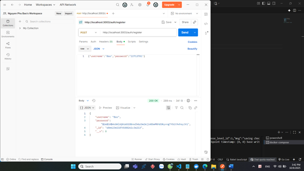  
  `./public/results/auth-register-success.png`

- Đăng ký thất bại (ví dụ)  
  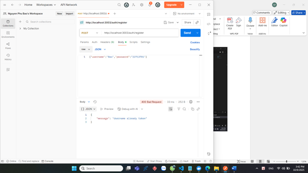  
  `./public/results/auth-register-fail1.png`

- Đăng ký thất bại 2  
    
  `./public/results/auth-register-fail2.png`

- Đăng nhập thành công  
  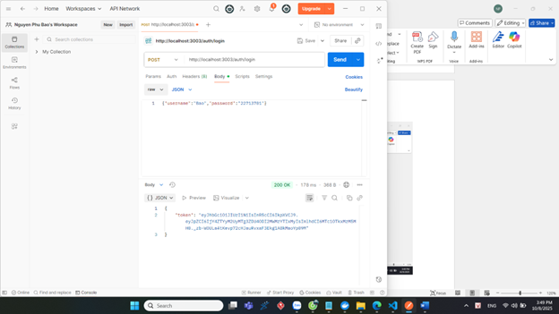  
  `./public/results/auth-login-success.png`

- Đăng nhập thất bại (1)  
  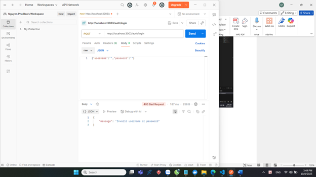  
  `./public/results/auth-login-fail.png`

- Đăng nhập thất bại (2)  
  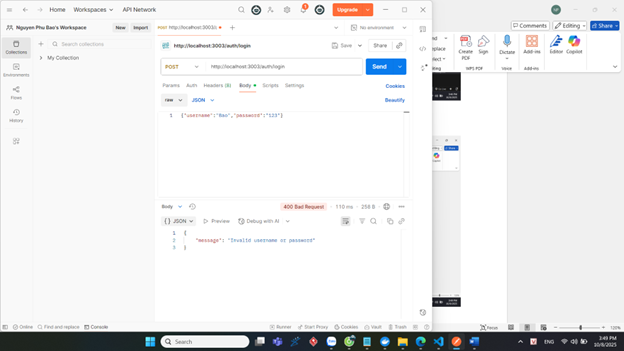  
  `./public/results/auth-login-fail2.png`

- Đăng nhập thất bại (3)  
  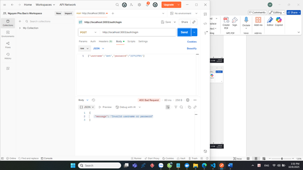  
  `./public/results/auth-login-fail3.png`

- Dashboard - success  
  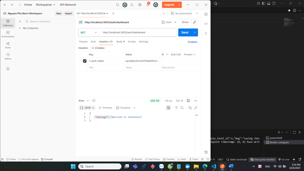  
  `./public/results/auth-dashboard-success.png`

- Dashboard - fail (1)  
  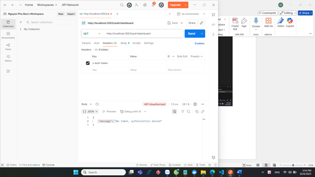  
  `./public/results/auth-dashboard-fail.png`

- Dashboard - fail (2)  
  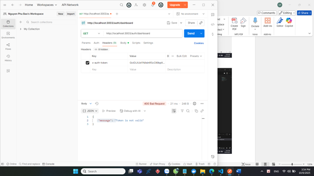  
  `./public/results/auth-dashboard-fail2.png`

---

#### Product - create / get / buy
- Tạo sản phẩm thành công  
  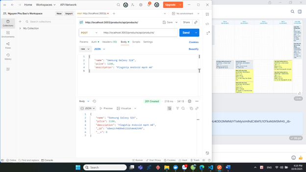  
  `./public/results/product-create-success.png`

- Tạo sản phẩm thất bại (1)  
  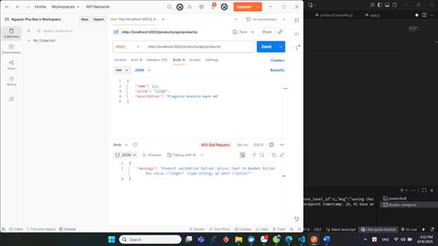  
  `./public/results/product-create-fail.png`

- Tạo sản phẩm thất bại (2)  
    
  `./public/results/product-create-fail2.png`

- Lấy danh sách sản phẩm thành công  
  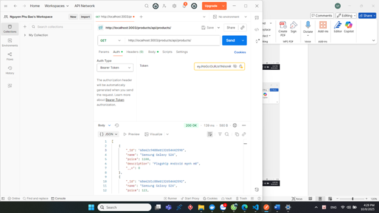  
  `./public/results/product-get-success.png`

- Lấy danh sách sản phẩm thất bại  
  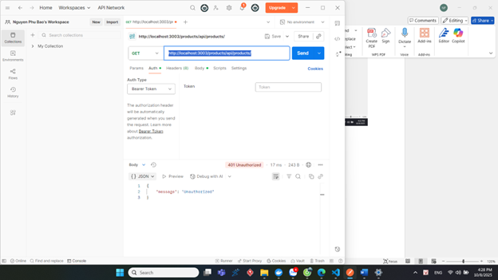  
  `./public/results/product-get-fail.png`

- Đặt hàng thành công  
    
  `./public/results/product-buy-success.png`

- Đặt hàng thất bại (1)  
  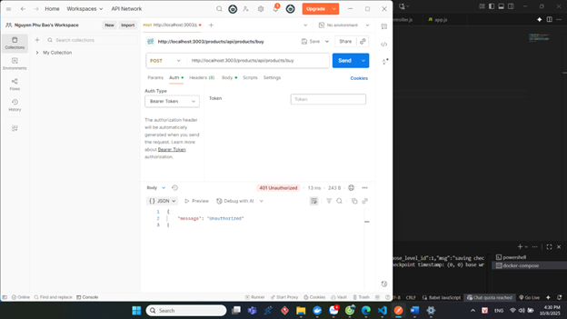  
  `./public/results/product-buy-fail.png`

- Đặt hàng thất bại (2)  
    
  `./public/results/product-buy-fail2.png`

- Đặt hàng thất bại (3)  
  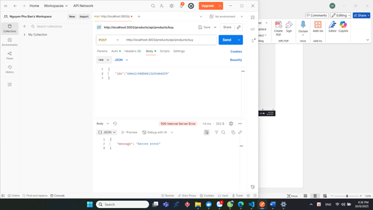  
  `./public/results/product-buy-fail3.png`

---

#### Kiểm tra cơ sở dữ liệu / tổng quan
- Kiểm tra databases (ảnh tổng quan)  
  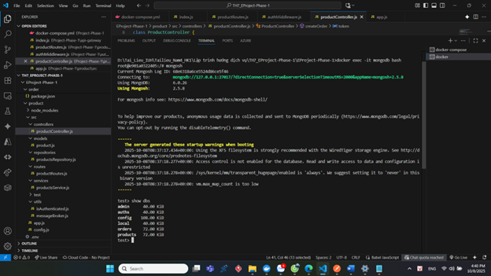  
  `./public/results/Check-databases.png`

- Dữ liệu trong DB `auths`  
    
  `./public/results/data-auths.png`

- Dữ liệu trong DB `products`  
  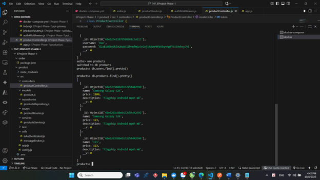  
  `./public/results/data-products.png`

- Dữ liệu trong DB `orders`  
  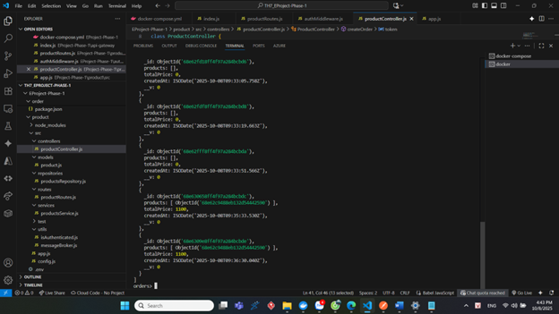  
  `./public/results/data-orders.png`

---

### 3 RabbitMQ Dashboard

Truy cập:
👉 http://localhost:15672

Mặc định:

Username: guest

Password: guest

Tại đây có thể xem các exchange, queue, và message giữa các service.
- Queue trong RabbitMQ 
  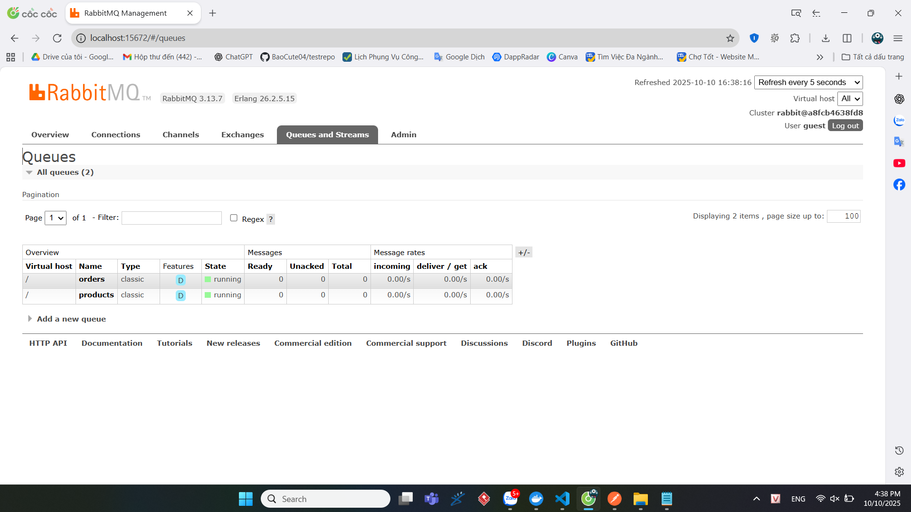  
  `./public/results/rabbitMQ.png`

### 4 🧹 Clean up (xóa container cũ)
`docker-compose down -v`
